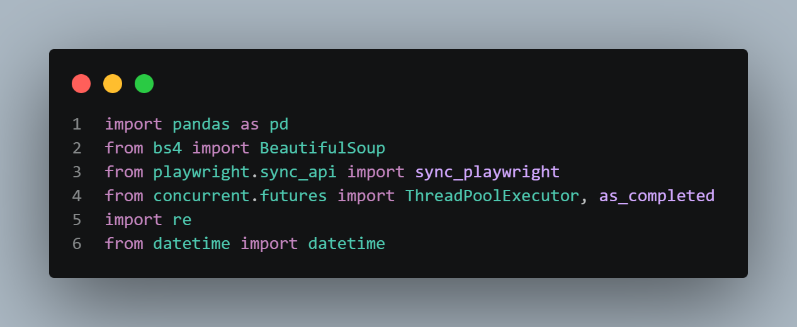
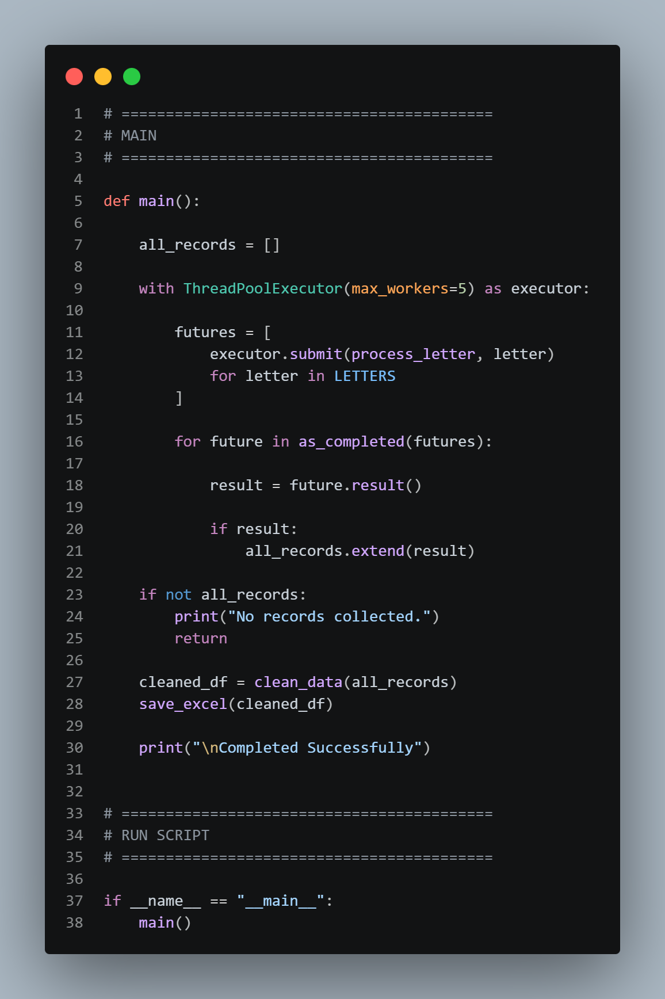
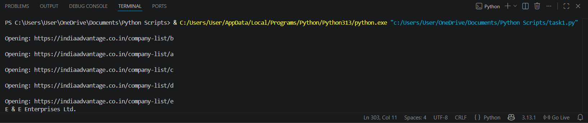
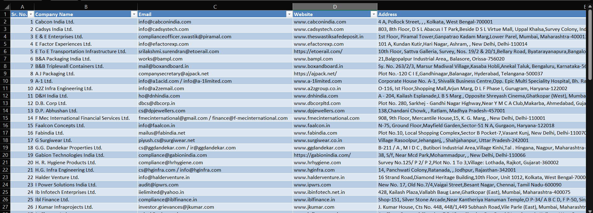

# 📊 Company Lead Scraper (India Advantage)

A Python-based web scraping automation project that extracts company information from a directory website, cleans the data, and exports it into a structured Excel file for analysis and lead generation.

---

## 📌 Project Overview

This project automates the extraction of business leads from an online company directory (A–Z listing pages). It collects structured company details such as contact information, website, and industry, then processes and exports them into a clean Excel dataset.

---

## 📸 Project Screenshots

This section shows the end-to-end workflow of the project.

---

### 1️⃣ Setup & Code Overview

<table>
  <tr>
    <td></td>
    <td></td>
  </tr>
</table>

---

### 2️⃣ Execution & Output

<table>
  <tr>
    <td></td>
    <td></td>
  </tr>
</table>

---

## 🧠 Script Workflow (Execution Flow)

```text
main()
 ├── scrape_company_links()
 │     └── Extract company profile URLs from listing pages (A–Z)
 │
 ├── scrape_company_details()
 │     └── Extract detailed company information (email, phone, website, etc.)
 │
 ├── clean_data()
 │     └── Clean and standardize data (remove duplicates, format fields)
 │
 └── save_excel()
       └── Export final structured dataset into Excel file
````

---

## 📁 Sample Output Dataset

| Sr. No | Company Name   | Email                                     | Website  | Phone      | Location       | Industry      | Timestamp           |
| ------ | -------------- | ----------------------------------------- | -------- | ---------- | -------------- | ------------- | ------------------- |
| 1      | ABC Pvt Ltd    | [info@abc.com](mailto:info@abc.com)       | abc.com  | 9876543210 | Telangana      | IT Services   | 2026-05-11 10:20:00 |
| 2      | XYZ Industries | [contact@xyz.com](mailto:contact@xyz.com) | xyz.in   | 9123456780 | Karnataka      | Manufacturing | 2026-05-11 10:22:10 |
| 3      | Tech Solutions | [hr@tech.com](mailto:hr@tech.com)         | tech.com | 9988776655 | Andhra Pradesh | Software      | 2026-05-11 10:25:30 |

---

## 🎯 Business Understanding

The goal of this project is to automate lead generation by extracting publicly available company data.

### Objectives:

* Automate company data collection
* Reduce manual lead generation effort
* Build structured dataset for analytics and outreach

### Challenges:

* Inconsistent phone formats
* Missing or incomplete data
* Slow page navigation
* Duplicate records

---

## 📊 Data Understanding

### Data Source:

* India Advantage Company Directory (A–Z pages)

### Extracted Fields:

* Company Name
* Email Address
* Website
* Phone Number
* Address
* Location
* Industry

### Future Improvements:

* Email validation system
* LinkedIn profile enrichment
* Database integration (MySQL/PostgreSQL)
* Parallel scraping optimization

---

## 🛠️ Technologies Used

* Python 3.x
* Playwright (Browser Automation)
* BeautifulSoup (HTML Parsing)
* Pandas (Data Processing)
* Regex (Data Cleaning)
* OpenPyXL (Excel Export)

---

## ⚙️ Setup Instructions

### 1️⃣ Install dependencies

```bash
pip install pandas beautifulsoup4 playwright openpyxl
```

### 2️⃣ Install Playwright browsers

```bash
playwright install
```

### 3️⃣ Run script

```bash
python script_name.py
```

---

## 🔄 Approach

### Step 1: Data Collection

* Scrape A–Z listing pages
* Extract company profile URLs

### Step 2: Data Extraction

* Visit each company profile page
* Extract structured company details

### Step 3: Data Cleaning

* Remove duplicates
* Normalize phone numbers and emails
* Handle missing values

### Step 4: Data Export

* Convert cleaned dataset into Excel format

---

## 📊 Data Insights

* ✔ Scraped across 26 alphabetical categories (A–Z)
* ✔ Structured dataset generation pipeline
* ✔ Duplicate removal implemented
* ✔ Standardized contact formats

---

## 🚀 Project Status

🟡 In Progress (v1.0)

### Completed:

* Web scraping pipeline
* Data cleaning system
* Excel export automation

### Upcoming:

* Parallel scraping optimization
* Database integration
* Streamlit dashboard visualization

---

## 👨‍💻 Credits

* India Advantage (data source)
* Python open-source community
* Playwright contributors
* BeautifulSoup & Pandas libraries

```
```
